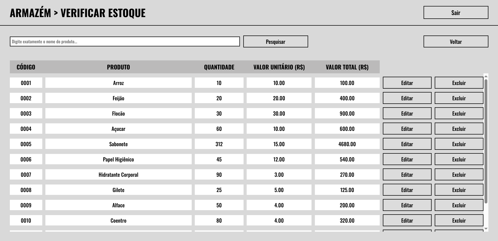

# Armazém: um sistema simples para controle de estoque

Aplicação web desenvolvida com **React** e **Vite** para gerenciamento de estoque de um armazém. O projeto oferece uma interface simples para autenticação de usuário, cadastro de produtos, consulta de estoque, adição e remoção de quantidades, além de edição e exclusão de itens cadastrados.

O sistema foi estruturado com foco em organização, separação de responsabilidades e facilidade de manutenção, utilizando componentes reutilizáveis, rotas centralizadas, camada de comunicação com API e dados mockados para auxiliar no desenvolvimento.

<div align="center">
    
</div>

## Sobre o projeto

O **Armazém** é uma aplicação frontend para controle de estoque. Seu principal objetivo é permitir que usuários realizem operações comuns em um armazém, como:

- Fazer login no sistema;
- Criar uma nova conta;
- Visualizar produtos cadastrados;
- Cadastrar novos produtos;
- Adicionar unidades ao estoque;
- Remover unidades do estoque;
- Consultar produtos disponíveis;
- Editar informações de produtos;
- Excluir produtos do estoque.

O projeto utiliza uma arquitetura frontend baseada em páginas, componentes reutilizáveis e serviços de API, tornando o código mais organizado e preparado para integração com um backend.

## Funcionalidades

### Autenticação

- Tela de login;
- Tela de cadastro de usuário;
- Armazenamento simples de token em memória durante a execução da aplicação;
- Validação básica de campos vazios;
- Exibição de mensagens por modal.

### Estoque

- Listagem de produtos;
- Cadastro de novos produtos;
- Consulta de estoque;
- Adição de quantidade em produtos existentes;
- Remoção de quantidade em produtos existentes;
- Edição de produtos;
- Exclusão de produtos.

### Interface

- Componentes reutilizáveis de botão, input, tabela, modal e mensagens de erro;
- Estilização modular com CSS Modules;
- Layout organizado para telas de autenticação e dashboard;
- Navegação entre páginas com React Router.

## Tecnologias utilizadas

O projeto foi desenvolvido com as seguintes tecnologias:

- [React](https://react.dev/) - Biblioteca para construção da interface;
- [React DOM](https://react.dev/reference/react-dom) - Renderização da aplicação React no navegador;
- [React Router DOM](https://reactrouter.com/) - Gerenciamento de rotas;
- [Vite](https://vite.dev/) - Ferramenta de build e ambiente de desenvolvimento;
- [Axios](https://axios-http.com/) - Cliente HTTP para comunicação com API;
- [Zod](https://zod.dev/) - Validação de variáveis de ambiente;
- [Oxlint](https://oxc.rs/docs/guide/usage/linter.html) - Ferramenta de lint para análise estática do código;
- CSS Modules - Escopo local para estilos de componentes e páginas.

## Estrutura de diretórios

A estrutura principal do projeto está organizada da seguinte forma:

```text
src/
├── api/ 
│ ├── client.js 
│ └── controllers/ 
│   ├── products.api.js 
│   └── users.api.js 
├── assets/ 
├── components/ 
│ ├── layout/ 
│ └── ui/ 
├── config/ 
│ └── env.js 
├── contexts/ 
│ └── ModalContext.jsx 
├── mocks/ 
│ ├── controllers/ 
│ └── data/ 
├── pages/ 
│ ├── auth/ 
│ └── dashboard/ 
│   └── features/ 
├── routes/ 
│ ├── error/ 
│ └── Router.jsx 
├── store/ 
│ └── appStore.js 
├── styles/ 
│ └── index.css 
├── utils/ 
│ └── util.jsx 
├── App.jsx 
└── main.jsx
```

## Pré-requisitos

Antes de executar o projeto, é necessário ter instalado:

- [Node.js](https://nodejs.org/) em uma versão compatível com Vite;
- [npm](https://www.npmjs.com/), normalmente instalado junto com o Node.js.

Para verificar as versões instaladas, execute:

```bash
node -v
npm -v
```

## Instalação

Clone o repositório e acesse a pasta do projeto:

```bash
git clone https://github.com/ariel-marquess/armazem-frontend && cd armazem-frontend
```

Instale as dependências:

```bash
npm install
```

## Configuração de ambiente

O projeto utiliza variáveis de ambiente para configurar a URL da API e o ambiente de execução.

Edite o arquivo `.env.development` na raiz do projeto:

```env
VITE_API_URL=http://endereco-da-api                        // Coloque a URL do servidor da API aqui
VITE_ENVIRONMENT=development
```

Veja o link do repositório da API utilizada neste projeto:

```text
COLOCAR A URL DA API AQUI
```

## Como executar o projeto

Para iniciar o ambiente de desenvolvimento, execute:

```bash
npm run dev
```

Por padrão, o Vite iniciará a aplicação em: **http://localhost:5173/**.

## Rotas da aplicação

A aplicação utiliza `react-router-dom` para gerenciamento de rotas.

| Rota                                  | Descrição                       |
|---------------------------------------|---------------------------------|
| `/`                                   | Tela de login                   |
| `/singup`                             | Tela de cadastro de usuário     |
| `/home`                               | Tela inicial do dashboard       |
| `/home/cadastrar-produto`             | Cadastro de produto             |
| `/home/adicionar-ao-estoque`          | Adicionar quantidade ao estoque |
| `/home/remover-do-estoque`            | Remover quantidade do estoque   |
| `/home/verificar-estoque`             | Consultar estoque               |
| `/home/verificar-estoque/editar/:id`  | Editar produto                  |
| `/home/verificar-estoque/excluir/:id` | Excluir produto                 |

Caso ocorra erro de navegação ou renderização em uma rota, a aplicação utiliza uma página de erro configurada no roteador.

## Uso de dados mockados

O projeto possui uma camada de mocks em:

```text
src/mocks/
```

Essa estrutura permite simular dados e respostas enquanto a API real não está disponível ou durante o desenvolvimento da interface.

Atualmente, algumas telas utilizam funções mockadas para autenticação e listagem de produtos